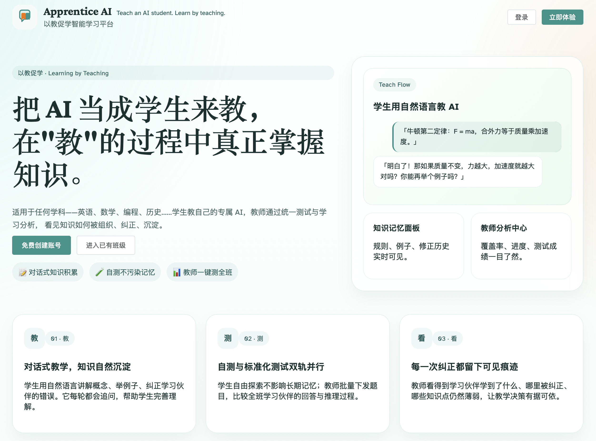
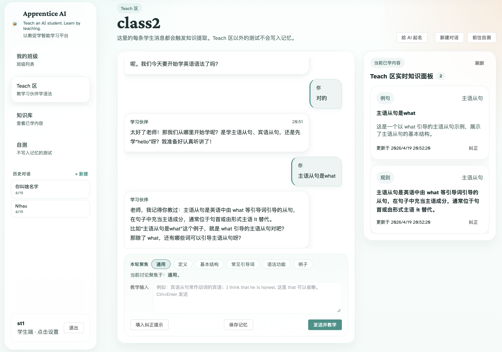
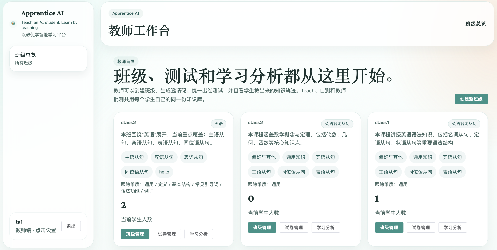

# Apprentice AI

> **以教促学 · Learning by Teaching**
>
> 把 AI 当成学生来教——在"教"的过程中真正掌握知识。

---

## 这是什么

**Apprentice AI** 是一个基于"以教促学"理论的英语语法学习平台。

传统学习是被动接收。这个平台反过来：**学生扮演老师，把语法规则教给 AI 学伴**。AI 会记住每位学生教过它的内容，教师再对 AI 进行统一测试——AI 答题的漏洞，就是学生自己理解的盲点。

```
学生用自然语言教 AI → AI 提取并记忆知识 → 教师统一出卷测试 → AI 作答暴露学习盲区
```

---

## 界面预览

### 首页


### 学生 Teach 区 · 对话教学 + 实时知识图板


> 左侧侧边栏显示历史对话列表；主区域是与 AI 的教学对话；右侧实时展示 AI 提取到的知识点，每条均可直接编辑或通过对话修正。

### 教师工作台 · 班级总览


> 教师可在工作台查看所有班级的知识覆盖率，进入班级管理、出卷测试、学习分析。

---

## 核心功能

### 学生端

| 功能 | 说明 |
|------|------|
| **Teach 区** | 用自然语言教 AI 学语法，系统自动提取知识点写入 AI 专属记忆 |
| **焦点芯片** | 发送前选择"定义 / 基本结构 / 例子…"等维度，引导 AI 有针对性地回应 |
| **历史对话** | 所有 Teach 会话保留，可随时切换查看；首条消息自动成为会话标题 |
| **知识库** | 可视化查看 AI 记住了什么，支持直接编辑、对话修正、查看改动日志 |
| **自测区** | 自由问答 + 自建选择题，测试 AI 掌握情况，不影响正式记忆 |
| **AI 起名** | 为每个班级的 AI 学伴起专属名字，个人设置互不影响 |
| **保存记忆** | 一键手动触发知识提取，无需等待自动流程 |

### 教师端

| 功能 | 说明 |
|------|------|
| **班级管理** | 创建班级、生成邀请码，设置课程范围与知识维度 |
| **课程范围编辑** | 可配置覆盖的从句类型（主/宾/表/同位语从句）及知识考查维度 |
| **出卷 & 批测** | 上传选择题或开放题，系统让每位学生的 AI 独立作答，横向对比 |
| **学习分析** | 班级知识覆盖热力图、单个学生知识树、完整对话记录查阅 |

### 系统特性

- 每位学生在每个班级拥有**完全独立**的 AI 记忆，换班级或换同学互不干扰
- AI 人格设定为**16 岁高中生**，只回答教过的内容，不自行发挥，主动追问引导深讲
- 对话超过 20 轮自动生成摘要，保持长对话的上下文连贯
- 测试 Worker 基于数据库轮询，**无需 Redis 或 Celery**

---

## 快速启动

### 方式一：本地开发（推荐初次上手）

```bash
# 后端
cd backend
python3 -m venv .venv && source .venv/bin/activate
pip install -r requirements.txt
cp .env.example .env          # MOCK_AI_ENABLED=true 已默认开启，无需 API Key
uvicorn app.main:app --reload  # http://localhost:8000

# 前端（新终端）
cd frontend
npm install
cp .env.example .env           # VITE_API_BASE_URL=http://localhost:8000
npm run dev                    # http://localhost:5173
```

### 方式二：Docker 一键启动

```bash
cp backend/.env.example backend/.env
docker compose up --build
```

### 接入真实 AI（DeepSeek）

在 `backend/.env` 中修改：

```ini
MOCK_AI_ENABLED=false
DEEPSEEK_API_KEY=your-key-here
```

---

## 生产部署

```bash
cp deploy/.env.server.example deploy/.env.server
# 填写：POSTGRES_PASSWORD / JWT_SECRET / TEACHER_REG_CODE / DEEPSEEK_API_KEY / FRONTEND_URL

docker compose -f docker-compose.prod.yml up -d --build
```

生产环境包含：PostgreSQL 持久化 · FastAPI + 后台 Worker · Nginx 静态前端 + `/api` 反代。

---

## 技术栈

| 层 | 技术 |
|----|------|
| 后端 | Python · FastAPI · SQLAlchemy (async) · PostgreSQL / SQLite |
| 前端 | Vue 3 · Vite · Pinia · Element Plus · Vue Router |
| AI | DeepSeek API（可用 `MOCK_AI_ENABLED=true` 替代） |
| 部署 | Docker Compose · Nginx |

---

## 开发说明

```bash
# 运行后端测试
cd backend && PYTHONPATH=. pytest tests/ -q

# 新增数据库字段（生产）
cd backend && alembic revision --autogenerate -m "描述"
alembic upgrade head
```

- 开发环境设置 `AUTO_CREATE_SCHEMA=true` 可跳过 Alembic，启动时自动建表
- `TEACHER_REG_CODE` 默认值见 `.env.example`，生产环境务必修改
- 提示词模板在 `backend/app/prompts/`，修改此处直接影响 AI 行为
